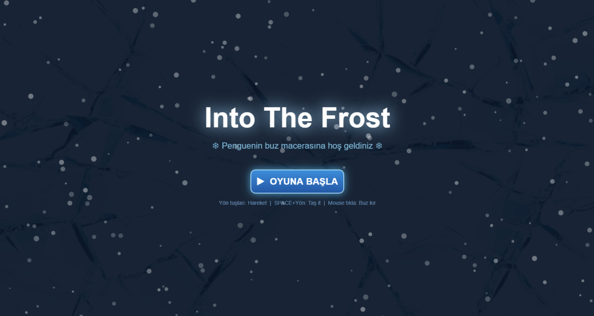
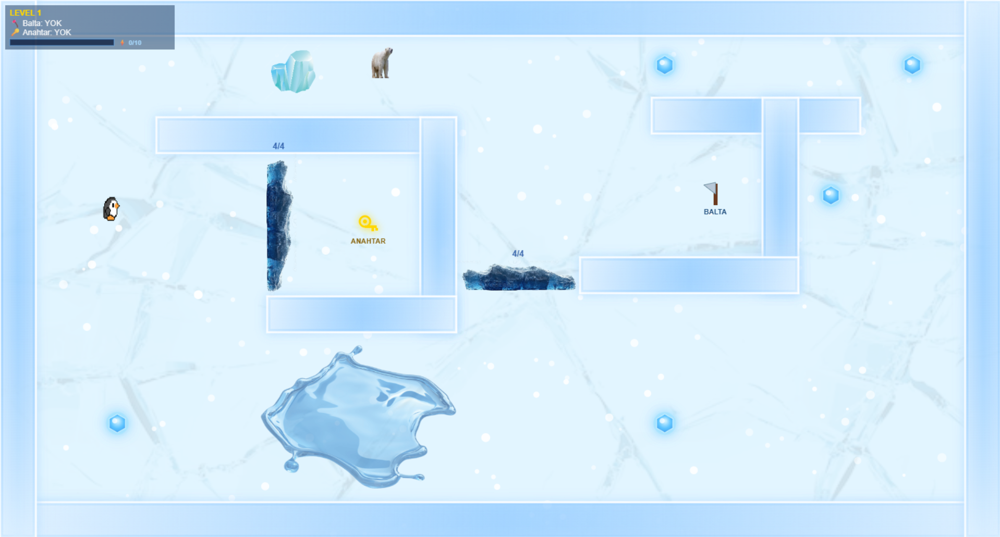
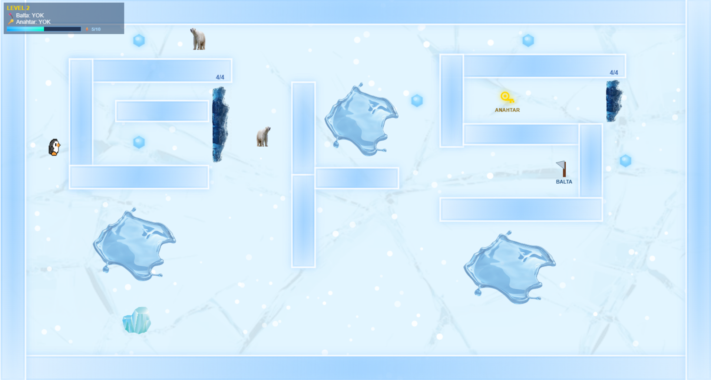
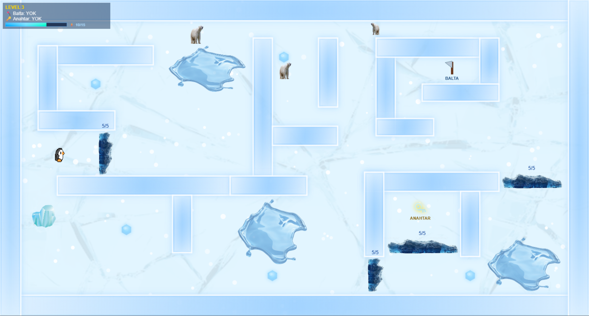
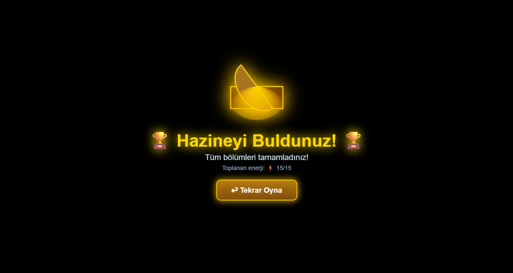

# Into The Frost

Into The Frost, Web Tabanlı Programlama dersi için geliştirilmiş 2D HTML5 Canvas macera oyunudur.

## 🎮 Oyunun Amacı
Enerji kristallerini toplayıp buz bloklarını kırıp kutup ayılarından kaç ve oyunun sonunda hazine sandığını aç.

## 🕹 Kontroller
- WASD / Yön Tuşları → Hareket
- SPACE + Yön → Taş itme
- Mouse Tıklaması → Buz kırma

## ✨ Oyun Özellikleri
- Çoklu level sistemi
- Enerji toplama sistemi
- Hazine sandığı sonu
- Kutup ayısı düşmanları
- Ses efektleri ve arka plan müziği
- Kar ve buz atmosferi efektleri

## 🔗 Canlı Oyun Linki
https://atessacan.github.io/into-the-frost/

## 📸 Oyun Görselleri

### Açılış Ekranı

### 1. Level

### 2. Level

### 3. Level

### Kazanma Ekranı

